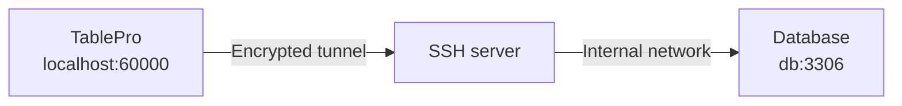

TablePro tunnels database connections through SSH using a built-in libssh2 client. No `ssh` binary or external setup is required. The tunnel opens a local forwarding port in the 60000-65000 range (this is why macOS may show a network permission prompt), sends a keep-alive every 30 seconds, and reconnects automatically if the tunnel dies. Before handing that port to the database driver, TablePro checks that the SSH server can actually reach the destination, so a wrong host or a blocked forward fails with the real reason instead of a database timeout.

The **SSH Tunnel** pane appears only for databases whose driver supports it. SQLite, PGlite, libSQL, Beancount, BigQuery, Cloudflare D1, DynamoDB, Elasticsearch, and Snowflake do not show it: they are reached over a local file, a loopback socket, or a vendor HTTP API.

## Setting Up

1. Open the connection form and switch to the **SSH Tunnel** pane
2. Toggle **Enable SSH Tunnel** on
3. Fill in **SSH Host**, **SSH Port** (default 22), and **SSH User**
4. Pick an authentication method
5. Back on **General**, click **Test Connection**

<Note>
The database **Host** and **Port** on the General pane are what the SSH server uses to reach the database, not what your Mac would use. Use `localhost` if the database runs on the SSH server itself, or the internal hostname (for example an RDS endpoint reached through a bastion) if it runs elsewhere. If the database listens on a Unix socket rather than a port, use [Socket Path](#forwarding-to-a-unix-socket) instead.
</Note>

A connection uses one connection method at a time. If a Cloudflare tunnel, Cloud SQL Auth Proxy, or SOCKS proxy is already enabled, the pane shows a button to disable it.

To reuse one SSH config across several connections, save it as a profile with **Save Current as Profile...** or pick one from the **Profile** picker. A selected profile replaces the inline fields with a read-only **Profile Details** summary. Switch the picker back to **Inline Configuration** to edit the settings on this connection. See [SSH Profiles](/features/ssh-profiles).

<Frame caption="Reusing a saved SSH profile">
  
  
</Frame>

## Authentication Methods

<Tabs>
  <Tab title="Password">
    Enter your SSH password in the **Password** field. Prefer keys for production servers.
  </Tab>
  <Tab title="Private Key">
    | Field | Description |
    |-------|-------------|
    | **Key File** | Path to your private key. Click **Browse** to pick one. |
    | **Passphrase** | Key passphrase, if the key is encrypted |

    Leave **Key File** empty to auto-detect the key from `~/.ssh/config` and default key locations.

    If the server also requires a keyboard-interactive step such as a 2FA code, TablePro prompts for it after the key is accepted.
  </Tab>
  <Tab title="SSH Agent">
    Signing is delegated to an agent process; TablePro never reads the key. The **Agent Socket** picker offers:

    - **SSH_AUTH_SOCK**: the system `SSH_AUTH_SOCK` environment variable
    - **1Password**: 1Password's socket at `~/Library/Group Containers/2BUA8C4S2C.com.1password/t/agent.sock`
    - **Custom Path**: any other agent socket path (Secretive, custom `ssh-agent`)

    If the server also requires a keyboard-interactive step such as a 2FA code, TablePro prompts for it after the agent authenticates.
  </Tab>
  <Tab title="Keyboard Interactive">
    Sends your password through SSH's keyboard-interactive challenge-response. Use this when the server rejects plain password auth, which is common with PAM-based setups.
  </Tab>
  <Tab title="None">
    Sends no password or key. Use this when the server authenticates the connection itself, such as a [Tailscale SSH](https://tailscale.com/kb/1193/tailscale-ssh) host or a bastion configured for passwordless access. If the server still requires credentials, the connection fails with a message telling you to pick another method.
  </Tab>
</Tabs>

### Verification Prompts and Two-Factor Authentication

If the SSH server issues a keyboard-interactive challenge during authentication, for example a verification code from `google-authenticator` or `duo_unix`, TablePro shows the server's prompt and lets you type the response. This works with every authentication method except **None**, including a private key or SSH agent followed by a second factor (`AuthenticationMethods publickey,keyboard-interactive`).

The **Two-Factor Authentication** section lets you skip that prompt for TOTP codes:

- **None** or **Prompt at Connect**: TablePro asks for the code when the server requests it.
- **Auto Generate**: TablePro computes the code from your base32 **TOTP Secret** (the key from your authenticator enrollment). Algorithm (SHA1, SHA256, SHA512), digits (6 or 8), and period (30s or 60s) are configurable; defaults match most setups.

## Host Keys

On first connection TablePro shows the server's key type and SHA-256 fingerprint (same format as `ssh-keygen -l`) and asks whether to trust it. Trusted keys are stored in `~/Library/Application Support/TablePro/known_hosts`.

If a trusted server's key changes, TablePro shows a warning with the old and new fingerprints. **Disconnect** is the default button; choose **Connect Anyway** only if you know the server was reinstalled. With jump hosts, every hop's key is verified.

## Using ~/.ssh/config

If `~/.ssh/config` has Host entries, a **Config Host** picker appears above the SSH Host field. Pick an alias and TablePro resolves `HostName`, `User`, `Port`, `IdentityFile`, `IdentityAgent`, and `ProxyJump` from the config at connect time. Values you type in the form override the config. The file is re-read whenever it changes, including `Include`d files.

<Frame caption="Picking a host from ~/.ssh/config">
  
  
</Frame>

## Jump Hosts

When the database sits behind one or more bastions, expand the **Jump Hosts** section and add each intermediate host in order. TablePro chains the hops in-process: each hop is an SSH session tunneled through the previous one, no `ssh` subprocess involved.

| Field | Description |
|-------|-------------|
| **Host** | Hostname or IP of the jump host |
| **Port** | SSH port (default 22) |
| **Username** | SSH username for this hop |
| **Auth** | **Private Key** or **SSH Agent** |
| **Key File** | Path to private key (Private Key auth only) |

Password auth is not available for jump hosts. If the jump host list is empty and the SSH host matches a config entry with a `ProxyJump` directive, TablePro follows it.

## Forwarding to a Unix Socket

Some servers only listen on a Unix socket, with no TCP port open at all. A PostgreSQL box configured for `local` connections in `pg_hba.conf` is the common case. Fill in **Socket Path** on the General pane and TablePro forwards to that socket instead of a host and port, the same thing `ssh -L 5434:/var/run/postgresql/.s.PGSQL.5432 server` does by hand. **Host** and **Port** are ignored while a socket path is set.

Give the path to the socket **file**, not the directory holding it:

| Database | Typical socket path |
|----------|---------------------|
| PostgreSQL | `/var/run/postgresql/.s.PGSQL.5432` |
| MySQL / MariaDB | `/var/run/mysqld/mysqld.sock` |
| Redis | `/var/run/redis/redis.sock` |

This works through jump hosts: the hops get you to the SSH server, and the socket is opened from there.

<Note>
A database listening on a Unix socket cannot negotiate TLS, so TablePro turns SSL off for the connection. Nothing is exposed by this: the whole path still runs inside the encrypted SSH tunnel.
</Note>

`peer` authentication works, because the connection to the socket is made by the SSH server as your SSH login user. So a `local all all peer` line authenticates you as the PostgreSQL role matching your SSH username.

The SSH server has to allow socket forwarding. It is on by default, but if `sshd_config` sets `AllowStreamLocalForwarding no`, TablePro says so instead of failing with a dropped connection. Note this is a separate setting from `AllowTcpForwarding`.

## Import from URL

Paste a `scheme+ssh://` URL to create a connection with SSH pre-filled. The `+ssh` suffix works with any non-file-based scheme (`mysql+ssh`, `postgres+ssh`, `redis+ssh`, `mongodb+ssh`, ...). TablePlus SSH URLs import directly. See the [Connection URL Reference](/databases/connection-urls#ssh-tunnel-format) for the format and parameters.

## Troubleshooting

**Tunnel connects but the database fails**: the database host is resolved from the SSH server, not your Mac. Verify it from the server: `ssh user@server "nc -z db-host 5432"`. Also check that the database credentials differ from the SSH ones where they should.

**"The SSH server could not reach \<host\>"**: the SSH connection is fine, but the SSH server could not open a connection to the database. Almost always the **Host** field. That address is resolved from the SSH server, not from your Mac, so if the database only listens on `127.0.0.1` (the default for MySQL and PostgreSQL), **Host** has to be `localhost`, not the server's public name or IP. Check what the database is bound to with `ss -lntp` on the server. If the host is right, check that `sshd_config` has `AllowTcpForwarding yes`.

**"The SSH server did not open a forwarding channel to \<host\>"**: the destination took the connection attempt and never answered, which usually means a firewall or security group is dropping packets rather than refusing them. Test it from the SSH server itself: `ssh user@server "nc -zv db-host 3306"`.

**Tunnel drops on idle networks**: TablePro already sends a libssh2 keep-alive every 30 seconds plus OS-level TCP keep-alives. If tunnels still drop, check the server's `ClientAliveInterval` and idle timeouts on firewalls or load balancers in between.

**Firewall prompt on connect**: TablePro listens on a local port between 60000 and 65000 for the tunnel. Allow it.

**SSH fails right away against a server on your own network**: macOS 15 and later gate outbound connections to local network addresses behind a Local Network permission, and a denied app fails fast with "no route to host". Check TablePro under System Settings > Privacy & Security > Local Network. Servers reached over the internet, and anything on `127.0.0.1`, are not affected.

**SSH itself fails**: test the same host, user, and key in Terminal with `ssh -v user@server`. If that fails, the problem is server-side, not TablePro.
