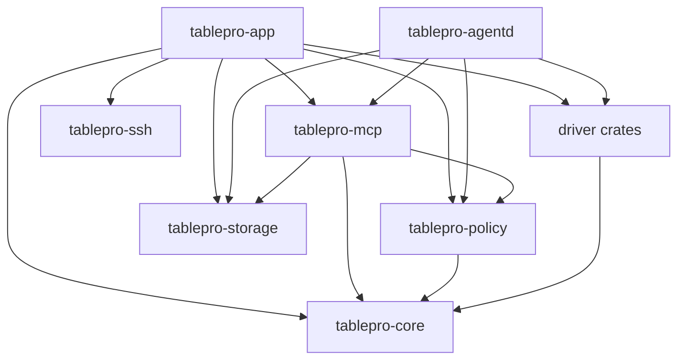

# Architecture

TablePro is a Linux-only Rust workspace rooted in `linux/`. GTK4 and Relm4 provide the desktop UI. Domain, policy, storage, SSH, MCP, and database drivers are separate crates so they can be tested without starting the application.

## Workspace layout

```text
linux/
├── Cargo.toml
├── crates/
│   ├── app/                 GTK4 and Relm4 application binary
│   ├── agentd/              headless MCP daemon
│   ├── core/                shared domain types and driver traits
│   ├── policy/              SQL classification, approval, masking, and audit rules
│   ├── mcp/                 MCP transport, tokens, allowlists, and rate limits
│   ├── storage/             connections, secrets, query history, and audit journal
│   ├── ssh/                 SSH tunnels and jump chains
│   ├── release-tests/       deterministic release checks against the PostgreSQL fixture
│   └── drivers/             one crate per database engine
├── tests/fixtures/          container fixtures for release checks
├── packaging/               internal Arch RC and development Debian files
├── flatpak/                 later Flatpak packaging work
└── scripts/                 local checks, integration tests, and package helpers
```

The workspace currently has these driver crates: PostgreSQL, MySQL, SQLite, SQL Server, ClickHouse, Redis, MongoDB, DuckDB, and Oracle.

## Dependency direction

`tablepro-core` defines shared connection options, values, errors, operation control, and driver traits. It does not depend on another workspace crate.

Driver crates implement the core traits. They do not depend on GTK. `tablepro-policy` applies authorization and audit rules around core connections. `tablepro-storage` owns saved connections, Secret Service access, query history, and the audit journal. `tablepro-mcp` combines core, policy, and storage behavior for MCP clients.

`tablepro-app` and `tablepro-agentd` are composition roots. They register drivers and assemble policy, storage, transport, and connection services for their process. `tablepro-release-tests` is a test-only consumer that assembles core, policy, SSH, storage, and the PostgreSQL driver against the release fixture.

## Transport and service identity

`ConnectOptions` separates the address a driver dials from the service identity TLS must verify. A direct connection dials its own host. An SSH tunnel keeps the saved host and port as the service identity and supplies the local endpoint separately: a loopback TCP port for modes that do not verify certificates, or a Unix socket in a private directory when the driver reports a forwarded socket name. The socket form is what lets a verifying PostgreSQL connection check the certificate against the original database hostname while the bytes travel through the tunnel. A driver that reports no socket name only ever receives a TCP endpoint, and verification then fails rather than accepting the local address.



Database drivers are linked into the binaries and registered in code. There is no runtime plugin ABI or driver discovery.

## Policy boundaries

MCP authorization and SQL policy answer different questions:

| Boundary | Responsibility |
|---|---|
| MCP token scopes and connection allowlists | Decide which saved connections and MCP tools a caller may access |
| `PolicyGuard` | Classify SQL, apply environment rules, request approval, mask results, and record audit events |

A token scope never bypasses `PolicyGuard`. Policy approval never bypasses a token's connection allowlist. The GTK app and `tablepro-agentd` build guarded connection handles before governed operations run.

Writes record an audit intent before driver execution and a terminal outcome afterward. Required audit failures deny governed writes. Recovered unresolved outcomes also keep governed writes disabled until they are handled.

## Async and GTK ownership

GTK objects belong to the GLib main context. Database calls and other blocking or async service work run on Tokio through Relm4 command tasks. Results return to component update methods as messages.

Use component-scoped commands for work tied to a tab or component lifetime. Detached Relm4 tasks are reserved for independent persistence and cleanup work. Do not access GTK widgets from Tokio worker threads.

The application creates a short-lived Tokio runtime during startup to initialize and prune query history before Relm4 starts the main application loop.

## UI structure

The application owns an `AdwTabView` for connection workspaces. Tabs are represented by typed Rust state and backed by Relm4 controllers. The application component routes child output by tab UUID so tab controllers do not depend on each other.

Table tabs combine data browsing and structure views. Pending row changes and pending structure changes are tracked by tab UUID. Closing, saving, discarding, and reconnecting pass through application-level routing so cross-tab state is handled in one place.

Workspace state is persisted per connection. Unknown persisted tab kinds deserialize to an `Unknown` variant and are dropped during restore instead of failing the whole file.

## Driver contract

Each driver exports a type that implements `tablepro_core::DatabaseDriver`. A successful connection returns a boxed `Connection` trait object. The connection trait covers query execution, parameterized operations, schema inspection, transactions, server activity, and controlled cancellation where supported.

`OperationControl` carries a cancellation token and an optional deadline. PostgreSQL controlled operations send a server cancellation request through a separate control pool, wait for the original operation to finish, and only return a connection to the pool when it is safe to reuse. Real PostgreSQL integration tests verify that cancelled and timed-out queries leave `pg_stat_activity` and that later queries still work.

See [docs/adding-drivers.md](docs/adding-drivers.md) for registration and test steps.

## Persistence

| Data | Backend | Default location |
|---|---|---|
| Saved connections | Versioned JSON | `$XDG_CONFIG_HOME/tablepro/connections.json` |
| Preferences | JSON | `$XDG_CONFIG_HOME/tablepro/preferences.json` |
| Window state | JSON | `$XDG_CONFIG_HOME/tablepro/window.json` |
| Workspace tabs | JSON | `$XDG_CONFIG_HOME/tablepro/workspace_state.json` |
| Column widths | JSON | `$XDG_CONFIG_HOME/tablepro/column_widths.json` |
| Table filters | JSON | `$XDG_CONFIG_HOME/tablepro/filter_settings.json` |
| Query history | SQLite with FTS5 | `$XDG_CONFIG_HOME/tablepro/history.db` |
| Audit records | Hash-chained JSONL | `$XDG_DATA_HOME/tablepro/audit.jsonl` |
| Passwords and SSH secrets | Secret Service through `oo7` | Desktop keyring |

When an XDG variable is unset, config files fall back to `~/.config/tablepro/` and the audit journal falls back to `~/.local/share/tablepro/`.

See [docs/storage.md](docs/storage.md) for details verified against the current implementation.

## Build and CI

The default full check excludes the optional DuckDB driver because it compiles a large native dependency tree:

```bash
cargo clippy --workspace --exclude tablepro-driver-duckdb --all-targets -- -D warnings
cargo test --workspace --exclude tablepro-driver-duckdb --lib --bins
```

CI runs GTK checks in an Ubuntu 25.10 container because the selected libadwaita and Relm4 features require a newer GLib than the Ubuntu 24.04 host provides. Driver integration tests run separately against Docker services.

## Deliberate limits

- Linux is the only supported operating system.
- Drivers are statically linked.
- There is no embedded browser UI.
- There is no in-process user scripting runtime.
- An internal Arch package is the first release target. Public AUR/Omarchy and Flatpak publication come later.
